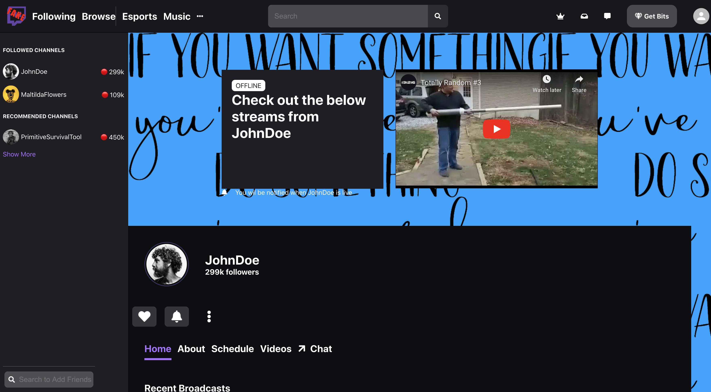

# **Twitch Mock UI Website**

### Click the link to view the website

[Twitch Mock UI Website](https://mock-twitch-ui.web.app/)

### About

##### Mock Twitch front-end UI built with React.js that simulates the UI of a JohnDoe user profile with random YouTube videos included.

#### Project Work:

##### https://github.com/davesheinbein

#### LinkedIn:

##### https://www.linkedin.com/in/david-sheinbein/

## Screenshot:

[Fake Twitch Screenshot](https://imgur.com/3x68clM)

## Technologies Used:

##### - HTML5

##### - CSS

##### - Sass

##### - JavaScript

##### - Node.js

##### - Firebase

##### - Git

##### - Github

## Potential Next Steps:

##### - [] Create a Dark Mode + Dark mode switch

##### - [] Update CSS further to make responsive on all size screens

### Click the link to view David Sheinbeins Portfolio website

[David Sheinbein's Portfolio Webstite](http://www.davidsheinbeinportfolio.com/)
